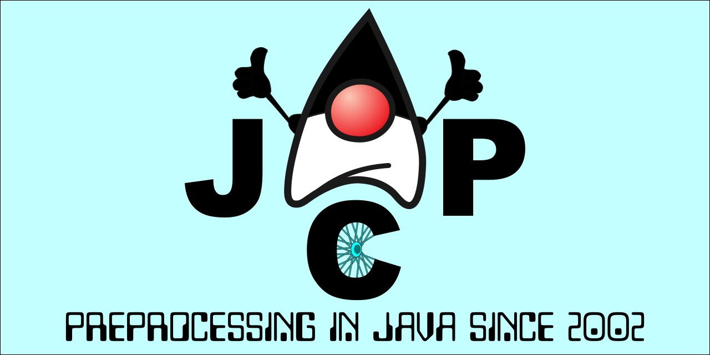
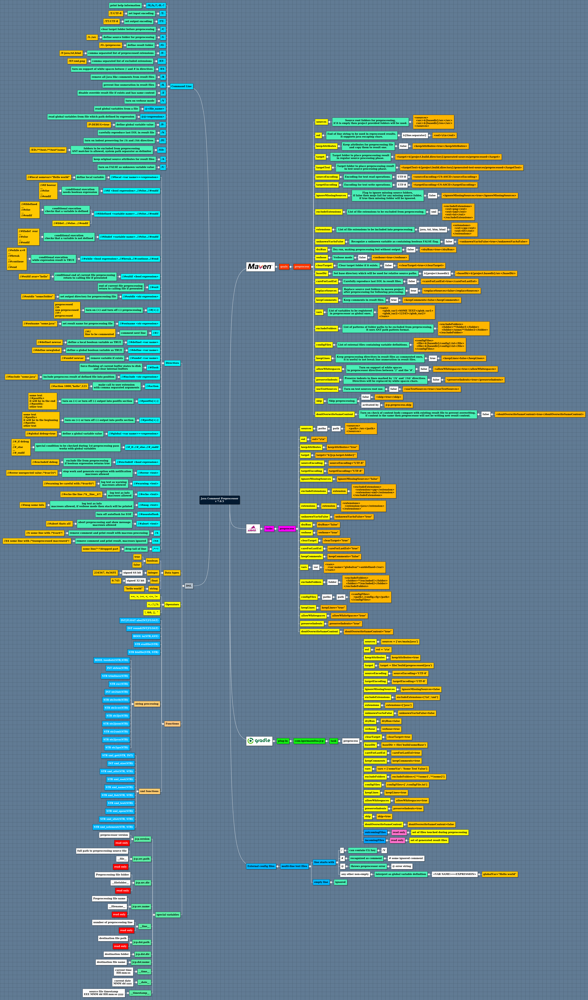

[](http://www.apache.org/licenses/LICENSE-2.0)
[](http://search.maven.org/#artifactdetails|com.igormaznitsa|jcp|7.0.4|jar)
[](http://www.oracle.com/technetwork/java/javase/downloads/index.html)
[](https://maven.apache.org/)
[](https://gradle.org/)
[](http://ant.apache.org/)
[](https://www.paypal.com/cgi-bin/webscr?cmd=_s-xclick&hosted_button_id=AHWJHJFBAWGL2)
[](http://yasobe.ru/na/iamoss)

# Changelog

__7.0.4 (26-ыуз-2020)__

- fixed default flag state `keep comments` for start in CLI
  mode [#24](https://github.com/raydac/java-comment-preprocessor/issues/24)
- fixed working directory detection in CLI mode

__7.0.3 (13-sep-2020)__

- added way to get info about all input and produced files from preprocessor context
- reworked Gradle plug-in, removed extension and now properties should be directly provided for
  task [#21](https://github.com/raydac/java-comment-preprocessor/issues/21)
- refactoring, removed some auxiliary plugins from build process and extra code

[Full changelog](https://github.com/raydac/java-comment-preprocessor/blob/master/changelog.txt)

# Introduction

Since 2001 I was strongly involved in development for J2ME mobile devices, it was too expensive to support the same
sources for different devices if to use standard Java OOP approach, so that I choosed C/C++ approach and developed
preprocessor which made my life much easier. Inintially it was a proprietary project but since 2011 it became OSS
project.

I guess, at present it is the most powerful Java preprocessor with support of two-pass preprocessing, document part support, loops and even use XML files as data sources ([I generated static files with it](jcp-tests/jcp-test-static-site)). Now it is implemented as a fat-jar and includes Maven, ANT and Gradle interfaces and can be used with these tools. For work it needs JDK 1.8+.

# Documap



# How to use

The Preprocessor can work as:
  - a CLI tool
  - a Java library
  - [a Maven goal](jcp-tests/jcp-test-maven)
  - [an ANT task](jcp-tests/jcp-test-ant)
  - [a Gradle task](jcp-tests/jcp-test-gradle)

The Preprocessor is published in the Maven Central (it is not published in Gradle central, so that use the Maven central)
```
    <build>
        <plugins>
...
           <plugin>
                <groupId>com.igormaznitsa</groupId>
                <artifactId>jcp</artifactId>
                <version>7.0.4</version>
                <executions>
                    <execution>
                        <id>preprocessSources</id>
                        <phase>generate-sources</phase>
                        <goals>
                            <goal>preprocess</goal>
                        </goals>
                    </execution>
                </executions>
            </plugin>
...
        </plugins>
    </build>    
```

# How to use from command line
The Preprocessor jar can be started under Java as a console application. Let's take a look at short example below how to start in command line under Linux The Easy variant of usage:
```
java -jar jcp-7.0.4.jar  --i:./test --o:./result
```
The Example just preprocess files from ./test folder which extensions allowed to be preprocessed by default, and places result into ./result folder, but keep in your mind that the preprocessor copies not all files, XML files will not be preprocessed by default. Files which extension are not marked for preprocessing will be just copied (of course if the extensions is not in the list of excluded file extensions)

More complex example:
```
java -jar jcp-7.0.4.jar  --c --r --v --f:java,xml --ef:none --i:./test --o:./result  '--p:HelloWorld=$Hello world$'
```
- --c clear the destination folder before work
- --r remove all Java-style comments from preprocessed result files
- --v show verbose log about preprocessing process
- --f include .java and .xml files into preprocessing (by default the preprocessor doesn't preprocess XNL files and the extension should to be defined explicitly)
- --ef don't exclude any extension from preprocessing
- --i use ./test as source folder
- --o use ./result as destination folder
- --p define named global variable HelloWorld? with the 'Hello world' content
- --z turn on checking of file content before replacement, if the same content then preprocessor will not replace the file  
- --es allow whitespace between comment and directive (by default it is turned off)

# Internal test examples
- [Prepare sources for Javassist](jcp-tests/jcp-test-javassist)
- [Make multi-versioned JAR  for JEP-238](jcp-tests/jcp-test-jep238)
- [Generate static file from XML sources](jcp-tests/jcp-test-static-site)
- [Simple Android Gradle-based project](jcp-tests/jcp-test-android)

# Example of Java sources with directives
In Java the only allowed way to inject directives and to not break work of tools and conpilers - is to use commented space, so that the preprocessor uses it.
```Java
//#local TESTVAR="TEST LOCAL VARIABLE"
//#echo TESTVAR=/*$TESTVAR$*/
//#include "./test/_MainProcedure.java"

public static final void testproc()
{
 System.out.println(/*$VARHELLO$*/);
 System.out.println("// Hello commentaries");
 //#local counter=10
        //#while counter!=0
        System.out.println("Number /*$counter$*/");
        //#local counter=counter-1
        //#end
 System.out.println("Current file name is /*$SRV_CUR_FILE$*/");
 System.out.println("Output dir is /*$SRV_OUT_DIR$*/");
 //#if issubstr("Hello","Hello world")
 System.out.println("Substring found");
 //#endif
}
```

# Multi-sectioned documents
In opposite a regular document, a Java document has as minimum two sections - prefix (where situated import and special information) and body. For access to such sections there are special preprocessing directives `//#prefix[-|+]`, `//#postfix[-|+]`. They allow to turn on or turn off output into prefix and postfix sections.
```Java
//#prefix+
 import java.lang.*;
 //#prefix-
 public class Main {
  //#prefix+
  import java.util.*;
  //#prefix-
  public static void main(String ... args){}
 }
```
# How to remove all coments from sources
Sometime it is very useful to remove totally all comments from sources, such possiblitiy was included into JCP and can be activated through special flag or command line switcher. The Example of use for comment removing through CLI interface
```
java -jar ./jcp-7.0.4.jar --i:/sourceFolder --o:/resultFolder -ef:none --r
```
